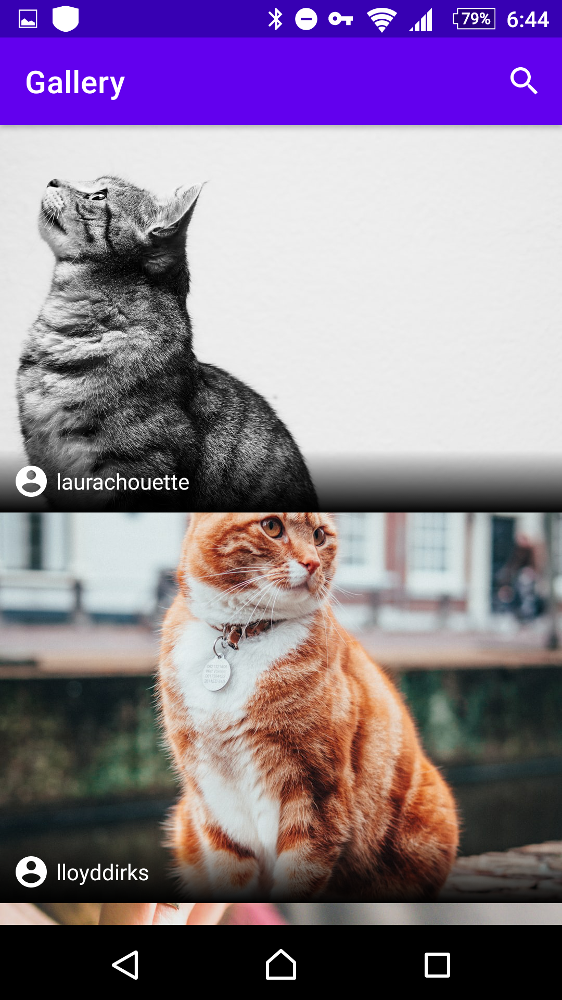
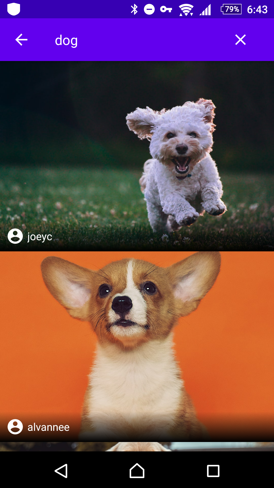

# Image search

This app use Unsplash API to get Images. It can search a keyword and return related images.

Using:
- Kotlin
- MVVM architectural pattern
- Single Activity pattern
- lifecycle
- LiveData
- RecyclerView
- Retrofit
- Navigation
- Dependency injection (Hilt)
- Paging

# Screenshot

